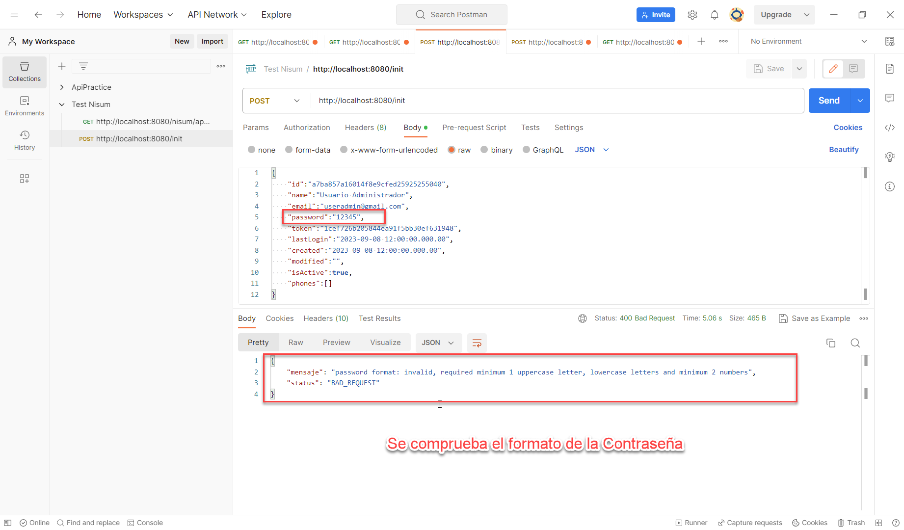
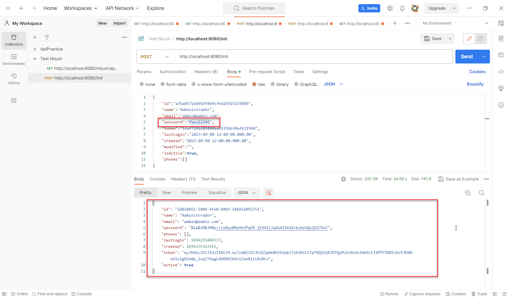
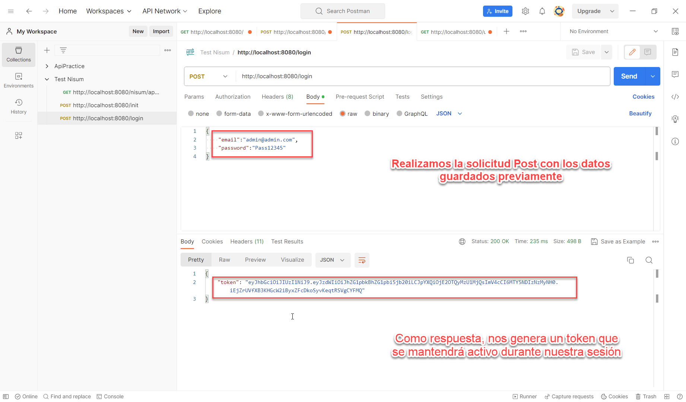
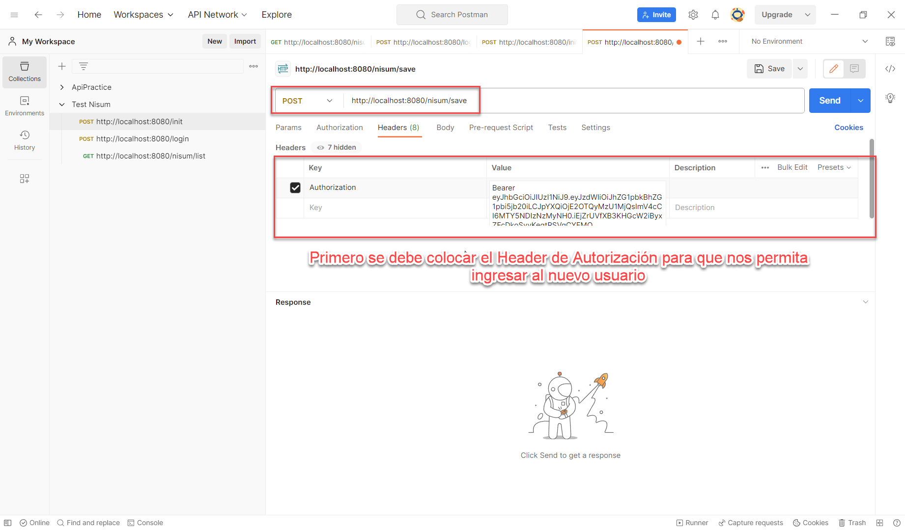
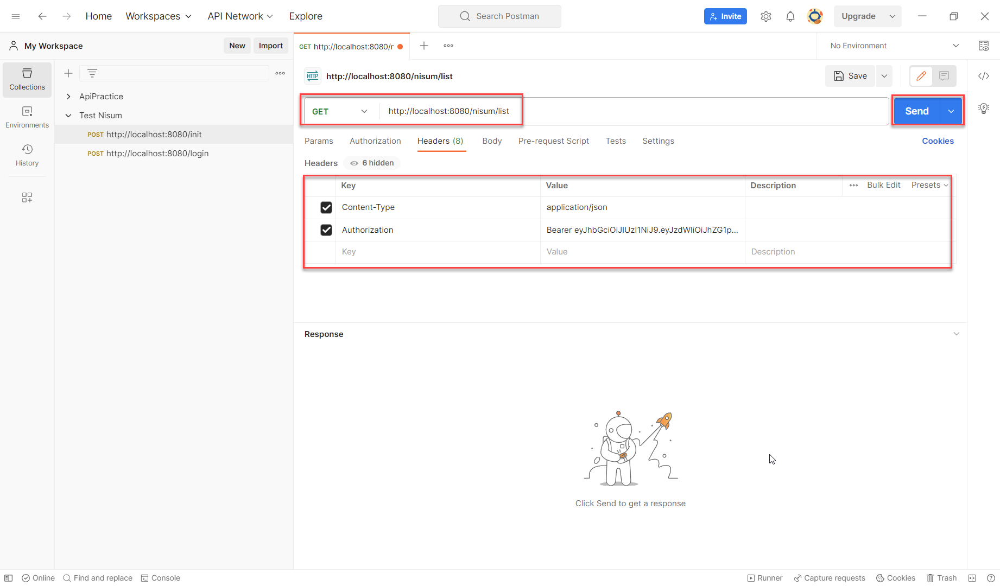
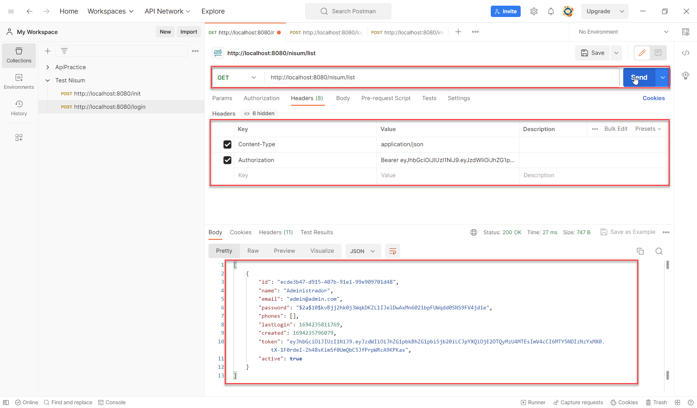
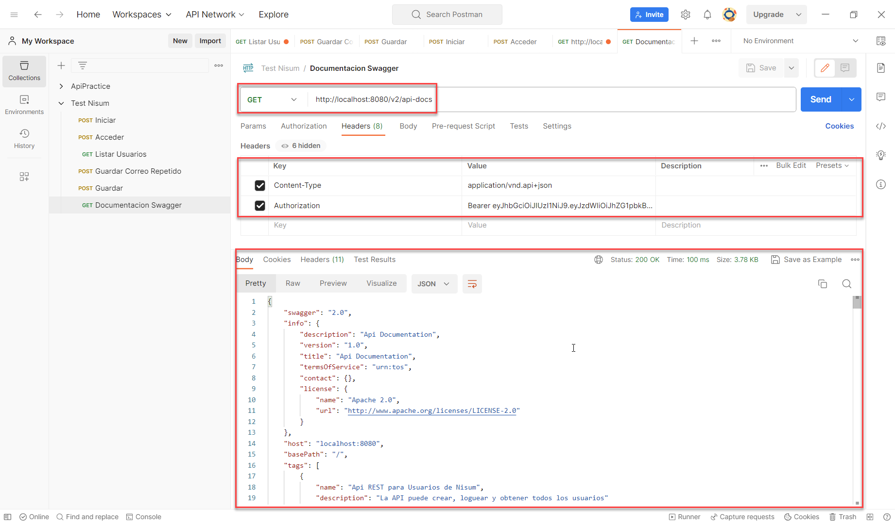

# Prueba de Nisum de Api de Usuarios para optar al puesto de Java Developer Senior

## Lic. Daniel Prado Amoretty

### Encabezado Principal
Desarrollar una aplicación que exponga una API RESTful de creación de usuarios.

### Framework / Tecnologías implementadas

* Spring Boot Web
  * Spring Boot Security
  * Spring Boot JPA (Hibernate)
  * JWT (Json Web Token)
* Swagger
* Lombok
* HSQLDB
* Mockito
* Maven
* Java 8

### Pasos a Seguir


#### 1. Clonar el Proyecto

 ```bash
   git clone https://github.com/danielquincy/api-creacion-usuarios.git
 ```

#### 2. Instalar
 ```bash
   mvn clean package install
 ```
#### 3. Ejecutar

 ```bash
   cd api-creacion-usuarios\target
   java -jar api-creacion-usuarios-0.0.1.jar
 ```

#### 4. Probar

* En Postman se usará el url http://localhost:8080/init
  Con Protocolo HTTP Post

### 1. Validar Formato de Contraseña.png
[](https://github.com/danielquincy/api-creacion-usuarios/blob/main/src/img/1.%20Validar%20Formato%20de%20Contraseña.png)


### 2. Guardado el Usuario de Inicio de Sesion Correctamente
[](https://raw.githubusercontent.com/danielquincy/api-creacion-usuarios/main/src/img/2.%20Guardado%20el%20Usuario%20de%20Inicio%20de%20Sesion%20Correctamente.png)


### 3. Login Satisfactorio



### 4. Header Para Nuevo Usuario



### 5. Guardando el Nuevo Registro


### 6. Listar los  Registros



### 7. Listado de los Registros Ingresados



### Documentación Swagger

* Usar Postman y el Protocolo HTTP GET: http://localhost:8080/v2/api-docs
  Validar que lleve autorización en el Header.

  

